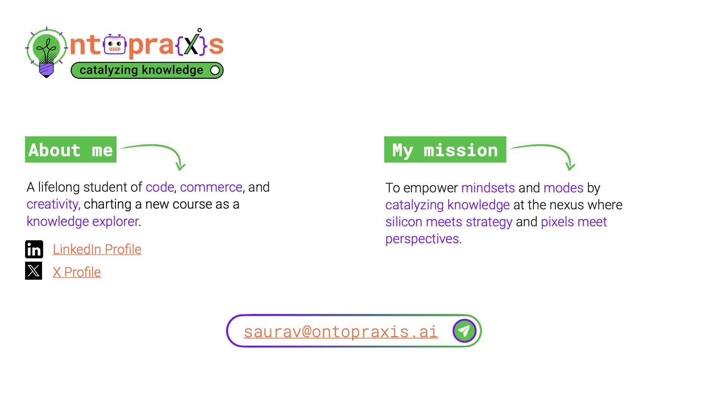

# Foundational Culture at Palantir: Shaping Tomorrow’s Software

**`Missionaries, Gamma Rays, and the Chaos of Innovation: Lessons from Palantir`**

<aside>
🚀

For nearly two decades, my career as a Go-To-Market practitioner at large Hi-tech firms followed a familiar script: prioritize predictable revenue streams, hit those quarterly targets, and stick to the established playbook.  Success was measured in metrics, not in any deeper sense of purpose or impact and while it brought financial rewards, it also led to a growing sense of disconnect.

In contrast to these norms, **Shyam Sankar**, CTO of [**Palantir Technologies**](https://www.palantir.com/), offers a refreshing and battle-tested perspective in his [**Pirate Wires**](https://www.piratewires.com/) article. His emphasis on the “[**Primacy of Winning**](https://www.piratewires.com/p/primacy-of-winning-shyam-sankar-palantir)” challenges us to redefine success, prioritize purpose, and ultimately, achieve a more meaningful impact.

</aside>

---

I've elaborated on Shyam's philosophy through examples from multi-disciplinary fields. I hope they bring you insights and inspiration, and perhaps you'll find ways to apply these in your own endeavors.

<aside>
👉

</aside>

---

I broadly categorized his philosophies into “**Mindsets**” a.k.a. Mental Models and “**Modes**” a.k.a. Operating Models and then expanded on each of them through this document. 

<aside>
💡

</aside>

---

The idea here is to push us towards a paradigm where our **professional lives serve a larger narrative of innovation, impact, and genuine value creation**.

<aside>
🏅

</aside>

---

On the importance of **building a "cult-like" atmosphere** where individuals are deeply passionate about their work.

<aside>
🕵️

</aside>

---

Work-life balance is a **false choice** for those who aspire to achieve great things. **Prioritize mission** above everything else.

<aside>
🤹

</aside>

---

Embrace **pain as an integral part** of real growth. View **discomfort as a catalyst** for personal and professional development.

<aside>
💪

</aside>

---

<aside>
🧑‍🎨

</aside>

---

Chaos, while often perceived as negative, is an **essential ingredient for innovation and achieving significant outcomes**. It encourages **experimentation**, fosters **adaptability**, and forces individuals to **think outside the box**.

<aside>
🤷‍♀️

</aside>

---

Acknowledge and accept that **exceptional individuals** often possess **distinct strengths and weaknesses**.

<aside>
🦸‍♀️

</aside>

---

Treat **position as an arbitrary construct**. The primary focus is on the artists and their work.

<aside>
⚒️

</aside>

---

<aside>
⚛️

</aside>

---

Achieving true success requires **managed misalignment**. Both perspectives must be present and actively engaged in a constructive tension. This tension is the source of true value creation.

<aside>
🤔

</aside>

---

<aside>
🥷

</aside>

---

The relentless **pursuit of winning is not for the faint of heart**. It demands dedication, sacrifice, and an unwavering commitment to the mission. It requires embracing chaos, pushing boundaries, and constantly seeking growth. But for t**hose who dare to answer the call, the rewards are immeasurable**. 

<aside>
🚴‍♂️

> “**It doesn’t get any easier, you just go faster.**”
- Greg LeMond, American Champion Cyclist
> 
</aside>

**Winning is** not just about achieving a goal; it's about **transforming yourself and the world around you**. So, step into the arena, embrace the challenge, and **let the primacy of winning guide you to greatness**.

<aside>
🙌

</aside>

---

<aside>
👉

</aside>

---

<aside>
📥

Here’s the **downloadable version**:

https://hub.ontopraxis.ai/primacy-of-winning

</aside>

---

<aside>
✍️

For more such ground-breaking content, you can follow **Shyam Sankar** on: ⬇️

LinkedIn: [https://www.linkedin.com/in/shyamsankar/](https://www.linkedin.com/in/shyamsankar/)

X: [https://x.com/ssankar](https://x.com/ssankar)

Substack: [https://www.shyamsankar.com/](https://www.shyamsankar.com/)

</aside>

---

<aside>
⛳

P.S. **Palantir has achieved remarkable milestones recently**:

- In September 2024, it was added to the **S&P 500 index**, signifying its financial stability and growth trajectory, and making it an attractive option for a broader range of investors, including index funds.
- By late October 2024, its **market capitalization** hit a landmark **$100 billion**. This milestone underscores the growing demand for Palantir's AI solutions, particularly its Artificial Intelligence Platform (AIP), which is being rapidly adopted across various sectors.

At 21 years old, Palantir stands at a pivotal moment, navigating through the transformative waves of AI technology. I'm truly excited to see how they continue to shape the future and will keep sharing insightful developments as they continue to ascend in this dynamic industry.

</aside>